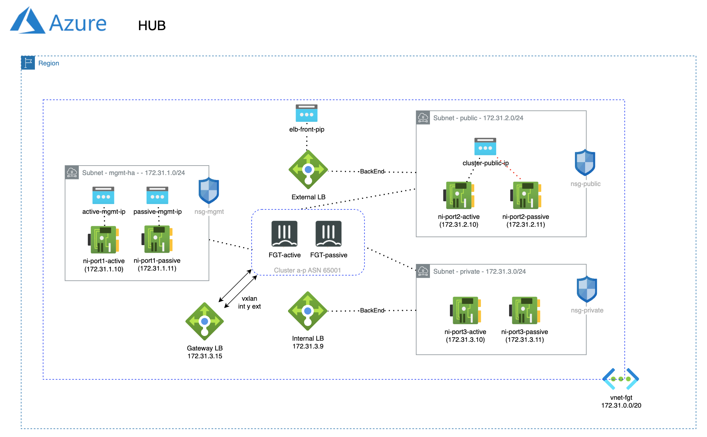

# Forigate cluster deployment
## Introduction

This deployment will create two Fortigate Clusters Active/Passive in two zones and with 3 ports (Management-HA, Public and Private), one acting as HUB and other acting as SDWAN spoke connected to HUB. 

Note: it is possible to configure mangement and HA sync port since within some interface since version 7.0.2

## Module use

### Variables

- `prefix`: Prefix to be used for resource naming
- `location`: Azure region where resources will be deployed
- `admin_cidr`: CIDR range for admin access
- `admin_username`: Administrator username for FortiGate instances
- `admin_password`: Administrator password for FortiGate instances
- `fgt_vnet_cidr`: CIDR block for the FortiGate VNet
- `resource_group_name`: Name of existing resource group (will create new if not specified)
- `storage-account_endpoint`: Storage account endpoint (will create new if not specified)
- `license_type`: FortiGate license type (BYOL or PAYG)
- `fgt_version`: FortiGate version to deploy
- `fgt_size`: Azure VM size for FortiGate instances
- `tags`: Map of tags to apply to resources

> [!NOTE]
> Those variables have a default value and if not provided, Azure related resources will be deployed or default values will be used. 

### Terraform code

```hcl
module "fgt-ha_onramp_xlb" {
    source = "./"

    resource_group_name = "<Resource Group Name>"           // (optional) module will create a new one if not provided
    storage_account_endpoint = "<Storage Account Endpoint>" // (optional) module will create a new one if not provided
    location = "francecentral"

    prefix = "fgt-ha-xlb"

    admin_cidr = "0.0.0.0/0"
    admin_username = "azureadmin"
    admin_password = "your-secret-password"

    fgt_vnet_cidr = "172.30.0.0/23"
}
```

## Deployment Overview

- New VNet with necessary subents: Management (MGMT), Public and Private
- Fortigate cluster: 2 instances with 4 interfaces in active-passive cluster FGCP.
- Load Balancer (LB) sandwich deployment, one LB for frontend and another for backend communications.
- HA failover is handeled by LB

## Diagram overview



## Requirements
* [Terraform](https://learn.hashicorp.com/terraform/getting-started/install.html) >= 1.0.0
* Check particulars requiriments for each deployment (Azure) 

## Support
This a personal repository with goal of testing and demo Fortinet solutions on the Cloud. No support is provided and must be used by your own responsability. Cloud Providers will charge for this deployments, please take it in count before proceed.

